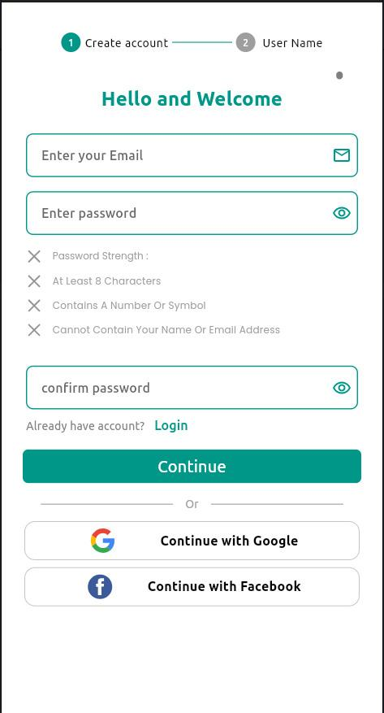
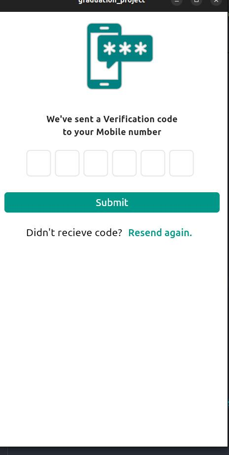
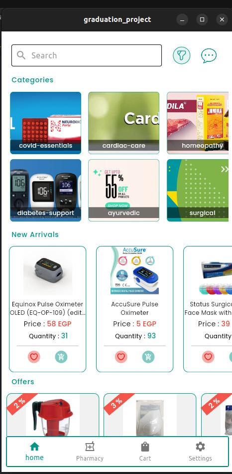
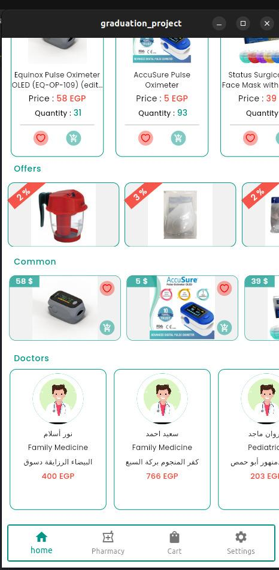
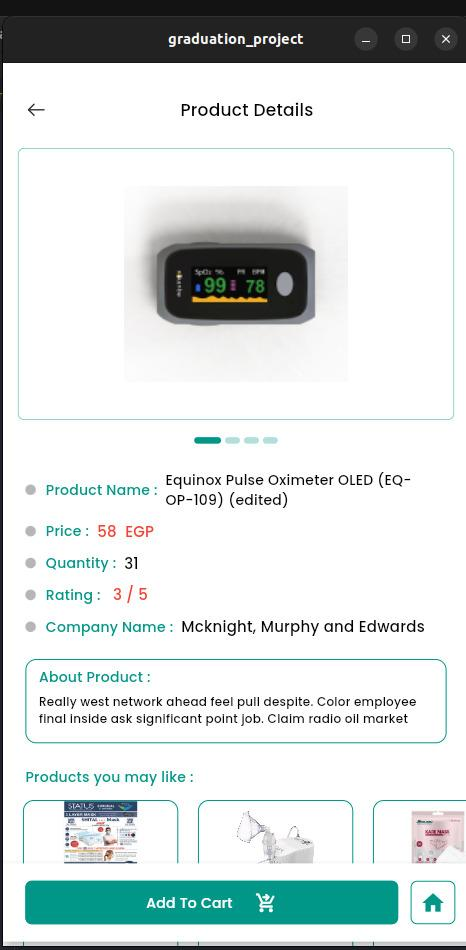
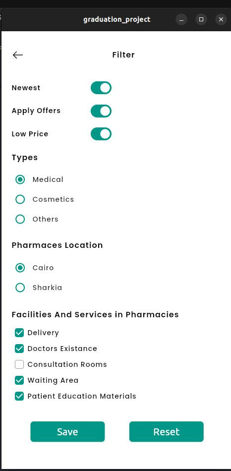
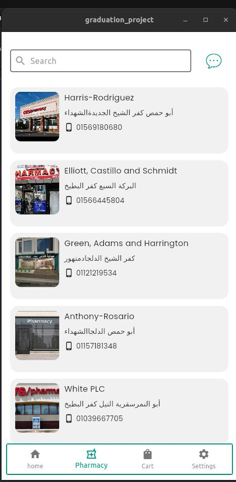
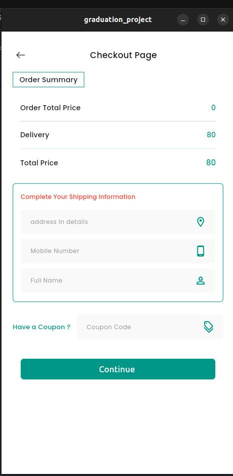
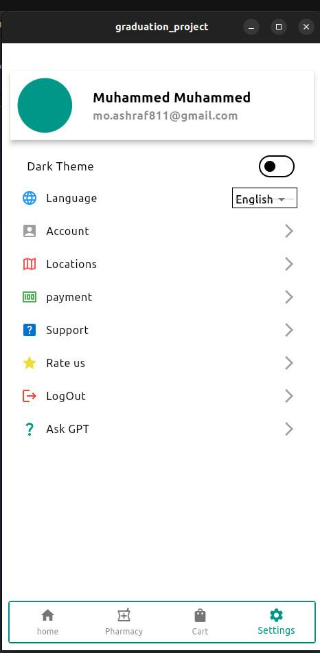

<div align="center">


# Ikseer · Smart Pharmacy

**An end‑to‑end smart pharmacy & medicine e‑commerce platform — browse, buy and get medicines picked by a robotic dispenser.**

[](https://flutter.dev)
[](https://dart.dev)
[](https://bloclibrary.dev)
[](#architecture)
[](https://paymob.com)
[](#features)
[](#features)
[](LICENSE)

</div>

---

## ✨ Overview

**Ikseer** (Arabic *إكسير* — "elixir") is a graduation project that reimagines the pharmacy experience. It is a full‑stack **smart pharmacy** system: a Flutter mobile app for customers, a cloud backend on Azure, and a **medicine‑picking robot** that physically retrieves ordered items from shelves — bridging e‑commerce and robotics.

Customers can discover nearby pharmacies, browse a categorised medical catalogue, compare offers, consult doctors, chat in real time, pay securely online, and track orders — while the robot handles fulfilment on the pharmacy side.

> This repository contains the **Flutter mobile application**. The backend API and robot firmware live in their own repositories.

---

## 📱 Screenshots

<div align="center">

| Register | OTP Verification | Login | Home | Offers & Doctors |
|:---:|:---:|:---:|:---:|:---:|
|  |  |  |  |  |

| Product Details | Smart Filter | Pharmacies | Checkout | Settings |
|:---:|:---:|:---:|:---:|:---:|
|  |  |  |  |  |

</div>

---

## 🚀 Features

| | Feature | Details |
|---|---|---|
| 🔐 | **Authentication** | Multi‑step registration with a progress stepper, live password‑strength validation, phone number input with country codes, **OTP verification**, login by email or username, forgot/reset password, and Google / Facebook sign‑in. |
| 🏠 | **Home & Discovery** | Categorised catalogue (covid essentials, cardiac care, diabetes support, surgical…), new arrivals, discount offers carousel, common products, and a doctors directory — all with shimmer loading states. |
| 🔎 | **Search & Smart Filter** | Full‑text search plus a filter sheet: newest, offers only, low price, product type, pharmacy location, and pharmacy facilities (delivery, doctors on site, consultation rooms…). |
| 💊 | **Product Details** | Image carousel, price, stock quantity, rating, manufacturer, description, and "products you may like" recommendations. |
| 🏥 | **Pharmacies** | Browse partner pharmacies with photos, address and phone; open a detailed pharmacy page with its inventory. |
| 🛒 | **Cart & Checkout** | Add / remove items, order summary with delivery fee, shipping details form, coupon codes, and **online card payment via Paymob**. |
| 🤖 | **Robotic Fulfilment** | Confirmed orders are dispatched to the pharmacy's medicine‑picking robot, which locates and retrieves items from the shelves automatically. |
| 💬 | **Real‑time Chat** | In‑app messaging with pharmacies / doctors, with image attachments. |
| 🧠 | **Ask AI** | Built‑in AI assistant (Google Gemini) for medicine and health questions. |
| 📍 | **Locations** | Google Maps integration with geolocation to show pharmacy locations and manage delivery addresses. |
| 👤 | **Profile & Settings** | Editable profile with image picker, saved addresses, payment methods, **dark mode**, and **English / Arabic** localisation. |

---

## 🏗️ Architecture

Feature‑first **Clean Architecture** with **BLoC / Cubit** state management and a clear data → logic → presentation split inside every feature.

```
lib/
├── main.dart                    # Bootstraps Dio, SharedPreferences, then runs the app
├── doc_doc.dart                 # Root widget: MultiBlocProvider + localisation + theming + router
│
├── core/                        # Cross‑cutting, feature‑agnostic code
│   ├── networking/              # Dio factory, request wrapper, Failure types, error mapping
│   ├── localStorage/            # SharedPreferences manager (token, onboarding, prefs)
│   ├── localization/            # LocalizationCubit (EN ↔ AR)
│   ├── theme/                   # ThemeCubit + light / dark ThemeData
│   ├── router/                  # Centralised onGenerateRoute
│   ├── constants/               # Colors, routes, storage keys, AI manager
│   ├── extensions/              # BuildContext helpers
│   ├── styles/                  # Fonts & text styles
│   └── widgets/                 # Reusable buttons, text fields, spacers, SVG handler
│
├── features/                    # One self‑contained module per feature
│   ├── on_bording/              # Onboarding pages
│   ├── register/                # data/ · logic/ · widgets/ · views
│   ├── login/                   # Login, OTP, forgot & change password
│   ├── home/                    # Categories, products, offers, doctors, pharmacies, search, filter
│   ├── cart/                    # Cart CRUD
│   ├── checkout/                # Paymob payment flow
│   ├── chat/                    # Chat list + conversation
│   ├── pharmcy/                 # Pharmacy listing
│   └── settings/                # Profile, locations, AI assistant, settings
│
├── l10n/                        # intl_en.arb · intl_ar.arb
└── generated/                   # Generated localisation delegates
```

### Design decisions

- **Functional error handling** — every network call returns `Either<Failure, T>` (via `dartz`), so cubits never throw; UI states map cleanly to success / failure.
- **Single Dio instance** — a `DioFactory` configures base URL, timeouts, auth headers and `pretty_dio_logger` once; features only call the thin `DioOperations` wrapper.
- **Persistent session** — JWT and user preferences are stored with `SharedPreferences`; `Hive` backs heavier local caching.
- **Localisation‑first** — all copy lives in `.arb` files and the app flips between LTR English and RTL Arabic at runtime with `LocalizationCubit`.
- **Responsive UI** — `flutter_screenutil` scales every dimension from the design baseline.

---

## 🛠️ Tech Stack

| Layer | Technology |
|---|---|
| Framework | [Flutter](https://flutter.dev) 3.x · Dart 3 |
| State management | [`flutter_bloc`](https://pub.dev/packages/flutter_bloc) · [`equatable`](https://pub.dev/packages/equatable) · [`provider`](https://pub.dev/packages/provider) |
| Networking | [`dio`](https://pub.dev/packages/dio) · [`pretty_dio_logger`](https://pub.dev/packages/pretty_dio_logger) · [`http`](https://pub.dev/packages/http) |
| Functional programming | [`dartz`](https://pub.dev/packages/dartz) (`Either` / `Failure`) |
| Local storage | [`shared_preferences`](https://pub.dev/packages/shared_preferences) · [`hive`](https://pub.dev/packages/hive) |
| Payments | [`paymob_payment`](https://pub.dev/packages/paymob_payment) |
| AI | [`flutter_gemini`](https://pub.dev/packages/flutter_gemini) |
| Maps & location | [`google_maps_flutter`](https://pub.dev/packages/google_maps_flutter) · [`geolocator`](https://pub.dev/packages/geolocator) · [`location`](https://pub.dev/packages/location) |
| Localisation | `flutter_localizations` · [`intl`](https://pub.dev/packages/intl) (`.arb`) |
| UI | [`flutter_screenutil`](https://pub.dev/packages/flutter_screenutil) · [`flutter_svg`](https://pub.dev/packages/flutter_svg) · [`lottie`](https://pub.dev/packages/lottie) · [`carousel_slider`](https://pub.dev/packages/carousel_slider) · [`shimmer`](https://pub.dev/packages/shimmer) · [`smooth_page_indicator`](https://pub.dev/packages/smooth_page_indicator) |
| Forms | [`flutter_otp_text_field`](https://pub.dev/packages/flutter_otp_text_field) · [`intl_phone_number_input`](https://pub.dev/packages/intl_phone_number_input) · [`image_picker`](https://pub.dev/packages/image_picker) |
| Backend | REST API hosted on **Microsoft Azure** |

---

## 🔄 How an order flows

```
 Customer app                Backend (Azure)              Pharmacy robot
 ────────────                ───────────────              ──────────────
 Browse & add to cart ──▶  Cart / inventory API
 Checkout + Paymob    ──▶  Payment verified
                            Order created         ──▶   Robot receives pick list
                                                        Locates shelf positions
                                                        Retrieves medicines
 Order status updates ◀──  Order fulfilled        ◀──   Items packed for delivery
```

---

## 🏁 Getting Started

### Prerequisites

- Flutter SDK **≥ 3.19** — [install guide](https://docs.flutter.dev/get-started/install)
- Android Studio / Xcode
- A Google Maps API key, a Paymob API key, and a Gemini API key

### Run locally

```bash
# 1. Clone
git clone https://github.com/MuAshraf811/grad_project.git
cd grad_project

# 2. Install dependencies
flutter pub get

# 3. Generate localisation files
flutter pub run intl_utils:generate   # or: dart run intl_utils:generate

# 4. Add your keys (see lib/core/constants/shared_pref_constants.dart and
#    android/app/src/main/AndroidManifest.xml for the Maps key)

# 5. Run
flutter run
```

### Build a release

```bash
flutter build apk --release
flutter build ios --release
```

---

## 👥 Team

Graduation project — Faculty of Engineering. Mobile application by **[Muhammed Ashraf](https://github.com/MuAshraf811)**; backend and robotics by the project team.

---

## 📄 License

Distributed under the MIT License. See [`LICENSE`](LICENSE).

---

<div align="center">

*If you found this project interesting, a ⭐ is much appreciated.*

</div>
